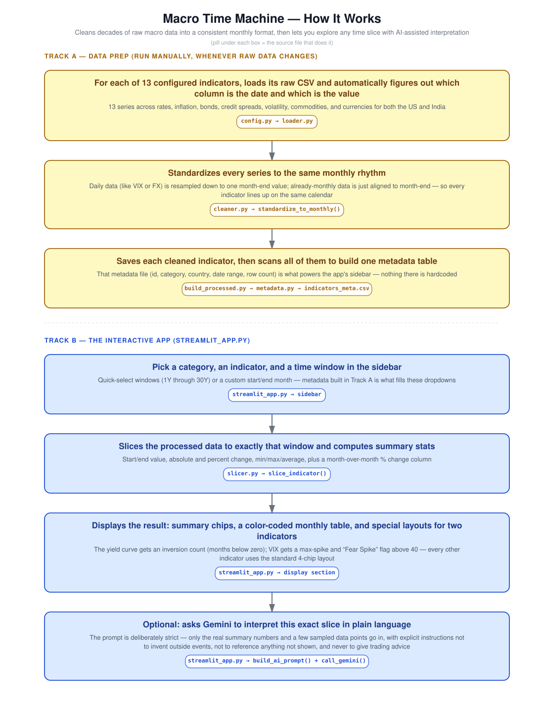

# Macro Time Machine

A Streamlit app for viewing historical macroeconomic and market time series (US and India), with an optional AI-generated summary of the selected period using Gemini.

<<<<<<< HEAD
=======
## Architecture

>>>>>>> ceb8dc0 (Local README edits with architecture diagram)

## Features

- Browse indicators grouped by category (Inflation, Interest Rates, Bond Market, Currencies, etc.)
- Select a quick time window (1Y, 3Y, 5Y, 10Y, 20Y, 30Y) or a custom date range
- View summary metrics: start value, end value, absolute change, percent change
- Separate summary views for the US 10Y–2Y yield curve (inversion tracking) and VIX (volatility spikes)
- Monthly data table with month-over-month change highlighted
- Optional AI interpretation of the selected period, generated via Gemini, based only on the numbers shown

## How the pipeline works

1. **Raw data** — CSV files for each indicator are placed in `data_raw/`.
2. **`loader.py`** — reads a raw CSV and identifies the date and value columns.
3. **`cleaner.py`** — resamples the data to monthly frequency and saves the result to `data_processed/`.
4. **`metadata.py`** — scans the processed files and builds an index (`indicators_meta.csv`) listing each indicator's category, country, and date coverage.
5. **`slicer.py`** — given an indicator and a time window or date range, returns the sliced data plus summary statistics (start/end value, change, min/max/average).
6. **`streamlit_app.py`** — the UI. Lets the user pick an indicator and range, displays the sliced data and summary, and optionally sends a prompt to Gemini for a text interpretation.

Processing raw data into `data_processed/` is a separate step (`build_processed.py`) from running the app — the app reads only from `data_processed/`.

## Usage guide

1. In the sidebar, pick a **Category**, then an **Indicator** within that category.
2. Choose a **Quick Select** time range, or leave it and enter a **Start** and **End** in `YYYY-MM` format for a custom range. If both start and end are filled in, the custom range is used instead of the quick select.
3. Click **Load Data**.
4. The page shows:
   - Summary metric chips (start, end, change, % change) — or, for the yield curve and VIX indicators, a different set of metrics specific to those series.
   - A monthly data table.
5. Optionally, click **Interpret this period with AI**. This sends the summary statistics and a sample of the data points to Gemini and displays the response. The interpretation is based only on the data shown — it does not reference external events and is not investment advice.

## Adding a new indicator

Add an entry to `INDICATOR_CONFIG` in `config.py`:

```python
"new_indicator_id": {
    "file": "new_indicator.csv",   # filename in data_raw/
    "country": "US",
    "category": "Some Category",
    "display": "Human-readable name",
},
```

Then place the corresponding CSV in `data_raw/` and run `build_processed.py` to generate the processed file and update the metadata index.

## Gemini AI setup 

The AI interpretation feature requires a Gemini API key. Add it to `.streamlit/secrets.toml`:

```toml
GEMINI_API_KEY = "your-key-here"
```

If no key is set, the app runs normally but shows a message instead of the AI interpretation, and the "Interpret" button is not shown.

## Notes and limitations

- All data is resampled to monthly frequency; the underlying source data may be daily or a different frequency originally.
- The AI interpretation is generated from the summary statistics and a sample of data points for the selected period only. It does not have access to external context or events, and should not be treated as financial advice.
- The app does not fetch live data. Indicators must be updated manually by adding new raw CSVs and re-running `build_processed.py`.